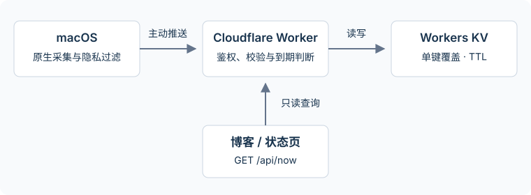

# 架构与设计约束

MacFlare 是单台 Mac 的公开状态发布器。Mac 负责采集并主动推送；Cloudflare Worker 验证和整理数据，Workers KV 仅保存当前快照，博客或 README 读取公开接口。

## 数据路径

1. 用户级 LaunchAgent 在登录后按间隔执行采集脚本，新安装默认 eco 间隔为 120 秒；无需 root。
2. 原生工具读取允许公开的状态。关闭的采集项不读取内容；采集失败通过空值或不可用状态表示。
3. 本地先过滤敏感应用，只发送应用名称，不发送窗口标题、路径、命令行、网页 URL、设备序列号或用户账户名。
4. 脚本通过 HTTPS 将 JSON 发送到 `/api/update`。接收令牌只存在本机受限配置文件和 Cloudflare Secret 中。
5. Worker 验证 Bearer、内容类型、体积及字段，把服务端时间加入快照，覆盖 KV 的固定键 `now`，设置服务端 TTL（默认配置 180 秒，实时模式 60 秒），并记录原始截止时间。
6. `/api/now` 读取 KV 并验证服务端接收时间。没有记录或记录不再新鲜时返回 `{"status":"offline"}`。

部署开发工具使用 Node.js 和 Wrangler。Mac 上的常驻采集流程不依赖 Node.js、Python、jq、Homebrew 或第三方播放器；JavaScript for Automation（JXA）由系统的 `/usr/bin/osascript` 执行，不是 Node.js。

## 时间、离线与一致性

“在线”表示 Worker 最近收到有效快照，不是对 Mac 当前联网、解锁或用户在场的证明。设备休眠、注销、网络中断、令牌错误、权限失败和平台配额耗尽都可能造成停止更新。

Worker 的新鲜度判断使用服务端时间，客户端无法用未来时间戳无限延长在线状态。TTL 由服务器部署配置决定，客户端不能覆盖；每条记录保留原始截止时间。Cloudflare KV 支持的最短过期 TTL 是 60 秒，过期优先于其读取缓存。[Cloudflare KV 写入与过期规则](https://developers.cloudflare.com/kv/api/write-key-value-pairs/)

KV 是最终一致存储。不同边缘位置可能在 60 秒或更久之后才看见更新，不存在记录的结果也会被缓存。因此，某个读者可能暂时看到旧快照或 `offline`；不能承诺全球读者秒级同步。服务端新鲜度检查能拒绝读到的过期快照，不能让尚未传播的新快照立即可见。[Cloudflare KV 一致性说明](https://developers.cloudflare.com/kv/concepts/how-kv-works/)

API 禁止普通 HTTP 缓存状态，但 GitHub 图片代理、嵌入网站和第三方消费者仍可能自行缓存。SVG 徽章是展示入口，不适合用来验证精确的新鲜度。

## 配额与调度

一次成功推送写入一个键。新安装默认 eco，每 120 秒推送、180 秒过期，每日定时写入约 720 次；realtime 每 30 秒推送、60 秒过期，每日约 2,880 次。免费计划当前每天 1,000 次键写入，UTC 零点重置；覆盖同一键、手动推送和其他项目均计入账户额度。具体计算、模式切换和读取优化见 [免费额度与更新策略](quotas.md)。

**全天持续在线、60 秒 TTL、免费 KV 每日写入配额，三者不能同时满足。** eco 通过延长采样和保留窗口减少写入；本项目不会自动升级套餐。

`launchd` 不是严格实时调度器。睡眠和任务执行耗时都会影响时间；同一任务不会并行无限堆积。系统调度的背景见 [Apple Launch Daemons and Agents](https://developer.apple.com/library/archive/documentation/MacOSX/Conceptual/BPSystemStartup/Chapters/CreatingLaunchdJobs.html)。

## 有意保留的边界

- 单设备、单键；两台设备共享同一部署会互相覆盖，应分别部署。
- 没有历史数据库、用户系统、远程命令、端口监听或从 Worker 回连 Mac 的通道。
- 不承诺防止第三方保存公开快照；KV 的 TTL 不会删除第三方副本。
- 不把请求错误正文或令牌写入公开响应，不把歌曲或应用名称用于执行代码。
- 强一致、多设备仲裁、私有读取和持久历史属于后续独立设计，见 [路线图](roadmap.md)。
