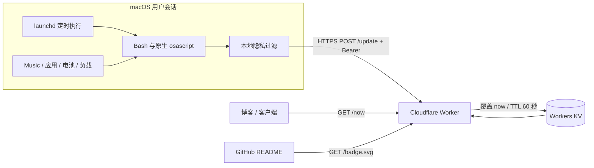

# 架构与设计约束

MacFlare 是单台 Mac 的公开状态发布器。Mac 负责采集并主动推送；Cloudflare Worker 验证和整理数据，Workers KV 仅保存当前快照，博客或 README 读取公开接口。

## 数据路径

1. 用户级 LaunchAgent 在登录后按间隔执行采集脚本，默认间隔为 30 秒；无需 root。
2. 原生工具读取允许公开的状态。关闭的采集项不读取内容；采集失败通过空值或不可用状态表示。
3. 本地先过滤敏感应用，只发送应用名称，不发送窗口标题、路径、命令行、网页 URL、设备序列号或用户账户名。
4. 脚本通过 HTTPS 将 JSON 发送到 `/update`。接收令牌只存在本机受限配置文件和 Cloudflare Secret 中。
5. Worker 验证 Bearer、内容类型、体积及字段，把服务端时间加入快照，覆盖 KV 的固定键 `now`，设置 `expirationTtl: 60`。
6. `/now` 读取 KV 并验证服务端接收时间。没有记录或记录不再新鲜时返回 `{"status":"offline"}`。

部署开发工具使用 Node.js 和 Wrangler。Mac 上的常驻采集流程不依赖 Node.js、Python、jq、Homebrew 或第三方播放器；JavaScript for Automation（JXA）由系统的 `/usr/bin/osascript` 执行，不是 Node.js。

## 时间、离线与一致性

“在线”表示 Worker 最近收到有效快照，不是对 Mac 当前联网、解锁或用户在场的证明。设备休眠、注销、网络中断、令牌错误、权限失败和平台配额耗尽都可能造成停止更新。

Worker 的新鲜度判断使用服务端时间，客户端无法用未来时间戳无限延长在线状态。TTL 由服务器固定，客户端不能覆盖。Cloudflare KV 支持的最短过期 TTL 是 60 秒，过期优先于其读取缓存。[Cloudflare KV 写入与过期规则](https://developers.cloudflare.com/kv/api/write-key-value-pairs/)

KV 是最终一致存储。不同边缘位置可能在 60 秒或更久之后才看见更新，不存在记录的结果也会被缓存。因此，某个读者可能暂时看到旧快照或 `offline`；不能承诺全球读者秒级同步。服务端新鲜度检查能拒绝读到的过期快照，不能让尚未传播的新快照立即可见。[Cloudflare KV 一致性说明](https://developers.cloudflare.com/kv/concepts/how-kv-works/)

API 禁止普通 HTTP 缓存状态，但 GitHub 图片代理、嵌入网站和第三方消费者仍可能自行缓存。SVG 徽章是展示入口，不适合用来验证精确的新鲜度。

## 配额与调度

一次成功推送写入一个键。持续在线一天时，30 秒间隔约产生 `86,400 / 30 = 2,880` 次写入；60 秒间隔也有 1,440 次。Cloudflare Workers KV 免费计划目前包含每天 1,000 次键写入，UTC 零点重置；超过配额后该类操作失败。重复覆盖同一个键也计入次数。[Cloudflare KV 价格和配额](https://developers.cloudflare.com/kv/platform/pricing/)

因此，**全天持续在线、60 秒 TTL、免费 KV 每日写入配额，三者不能同时满足**。默认 30 秒间隔适合按使用时长核算；只计算推送时，1,000 次约覆盖 8 小时 20 分钟，手动测试等其他写入会减少余量。把间隔调到 90 秒可将全天定时写入降至约 960 次，但 60 秒 TTL 会使每轮间隔产生离线窗口，不能算连续在线方案。本项目不会自动购买或升级套餐。

`launchd` 不是严格实时调度器。睡眠和任务执行耗时都会影响时间；同一任务不会并行无限堆积。系统调度的背景见 [Apple Launch Daemons and Agents](https://developer.apple.com/library/archive/documentation/MacOSX/Conceptual/BPSystemStartup/Chapters/CreatingLaunchdJobs.html)。

## 有意保留的边界

- 单设备、单键；两台设备共享同一部署会互相覆盖，应分别部署。
- 没有历史数据库、用户系统、远程命令、端口监听或从 Worker 回连 Mac 的通道。
- 不承诺防止第三方保存公开快照；KV 的 TTL 不会删除第三方副本。
- 不把请求错误正文或令牌写入公开响应，不把歌曲或应用名称用于执行代码。
- 强一致、多设备仲裁、私有读取和持久历史属于后续独立设计，见 [路线图](roadmap.md)。
